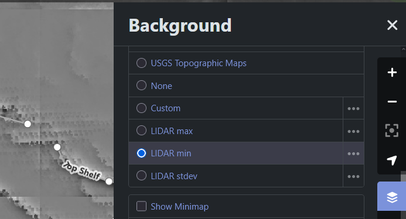

# iD editor: more custom background slots

Userscript that adds extra editable background tile URL slots to the [OpenStreetMap iD editor](https://www.openstreetmap.org/edit), alongside the built-in single "Custom" background.

**Disclaimer:** This was entirely vibe-coded with [Cursor](https://cursor.com/) and [Claude Code](https://claude.com/claude-code). I do not assert copyright over it, barely know JavaScript, and have not verified that it is safe. Use at your own risk.

Related upstream discussion:

- [openstreetmap/iD#8874](https://github.com/openstreetmap/iD/issues/8874): Add Custom 1, 2, 3 Backgrounds
- [openstreetmap/iD#10055](https://github.com/openstreetmap/iD/issues/10055): Possibility to use more that one custom layer on ID editor

## Install

1. Install a userscript manager: [Violentmonkey](https://addons.mozilla.org/firefox/addon/violentmonkey/) or Tampermonkey on **Firefox**; **Tampermonkey** on **Chrome**.
2. **Chrome only:** open `chrome://extensions`, turn on **Developer mode**, then open Tampermonkey’s **Details** and enable **Allow user scripts** (needed for Chrome’s userScripts API so the script can run in the page’s JS world). Without this, the hook often never sees the real `window.iD` and nothing appears to work.
3. Install the script:
   **[iD-editor-more-custom-slots.user.js](https://raw.githubusercontent.com/endolith/iD-editor-more-custom-slots/main/iD-editor-more-custom-slots.user.js)**
   ([Greasy Fork](https://greasyfork.org/en/scripts/571556-id-editor-more-custom-background-slots) is fine too; it may rewrite update URLs.)

## Usage

Open the [iD editor](https://www.openstreetmap.org/edit). In the **Background** panel, extra slots appear next to the built-in **Custom** entry (labelled "Custom 1", "Custom 2", etc.). Click the **⋯** button next to any slot to set its name and tile URL template in the same way as for the regular **Custom** slot.  The name of the slot will be updated to match the name you set.  You can now switch between backgrounds much more easily.

## Development

### Releases

Bump `// @version` in the header and `SCRIPT_VERSION` inside the script to the same value. Also update `@updateURL` / `@downloadURL` if the branch or filename ever changes.

### How it works

There is no supported iD API to “add more custom backgrounds,” so the script has to integrate with iD’s internals.

- The script is a **plain IIFE** with **`@grant none`** (no `GM_addElement`). It must run in the **page** JavaScript world (same as the iD bundle). On Chrome, **Developer mode** + **Allow user scripts** for Tampermonkey is what makes that happen; otherwise the manager stays isolated and you never see the real `window.iD`.
- **`Proxy` on `window.iD`** intercepts reads of **`coreContext`**, which iD defines as a **non-configurable** getter — you cannot replace it with a normal assignment. The proxy is the straightforward way to wrap the factory, not a hack on top of a hack.
- **Late fallback** (wait for the background UI, then mutate the shared imagery list) runs if the early path missed.

**Chrome:** if `hooked` stays `false`, enable **Developer mode** + **Allow user scripts** for Tampermonkey (see Install). That was the usual reason it failed before; OSM CSP alone was a red herring in isolation.

### Troubleshooting

On the iD document (`openstreetmap.org/id`), check `window.__iDExtraBg`. After the map loads, `hooked` should be `true`. If not: reinstall, check the console, and on **Chrome** confirm Tampermonkey’s **Allow user scripts** is on.
